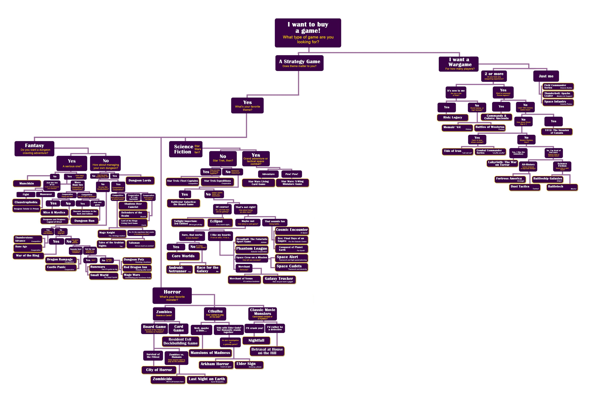

# Informacje o projekcie
System ekspercki ma na celu wspomaganie użytkowników w wyborze gry planszowej, system analizuje odpowiedzi użytkownika i sugeruje najbardziej odpowiednie tytuły.
## Autorzy
- [Piotr Żurek L6]
- [Mateusz Graja L6]

## Wersja pythona
- Python 3.10.4

## Wykorzystywane biblioteki 
- clipspy 1.0.4
- tkinker, customtkinker
- PIL

